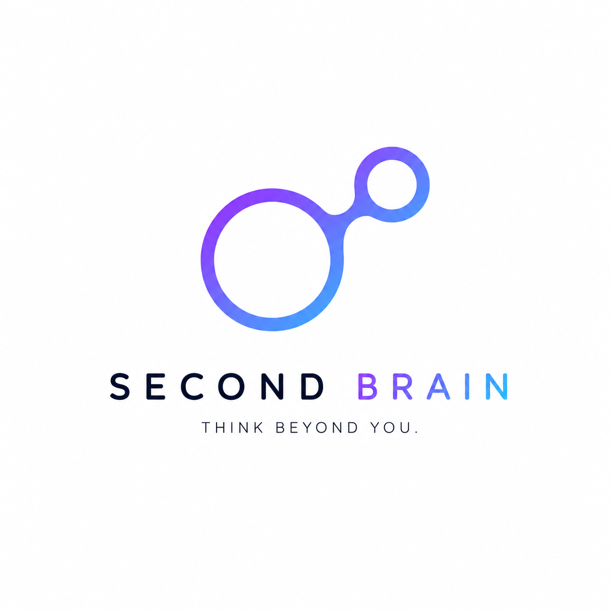
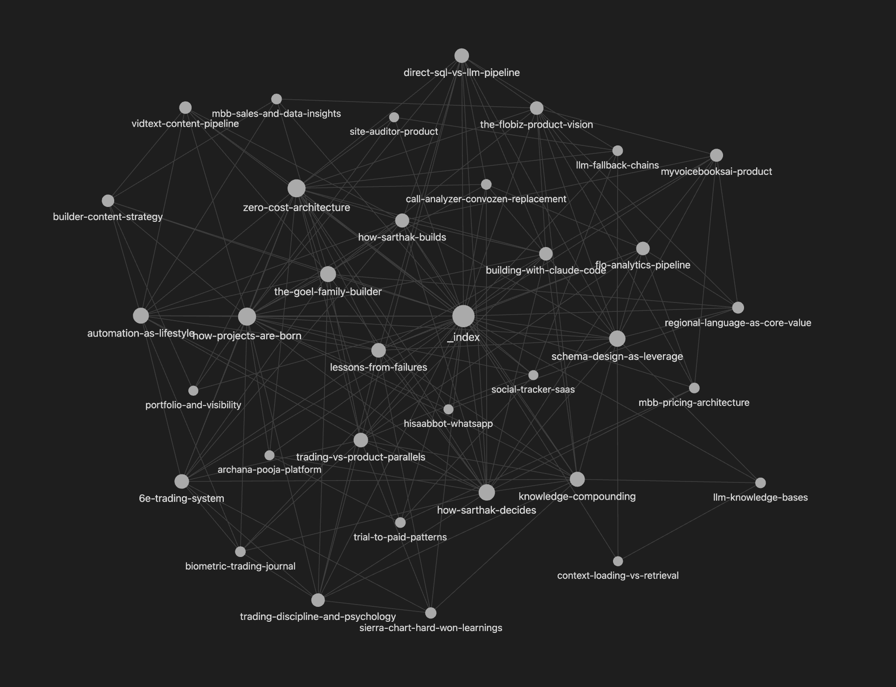
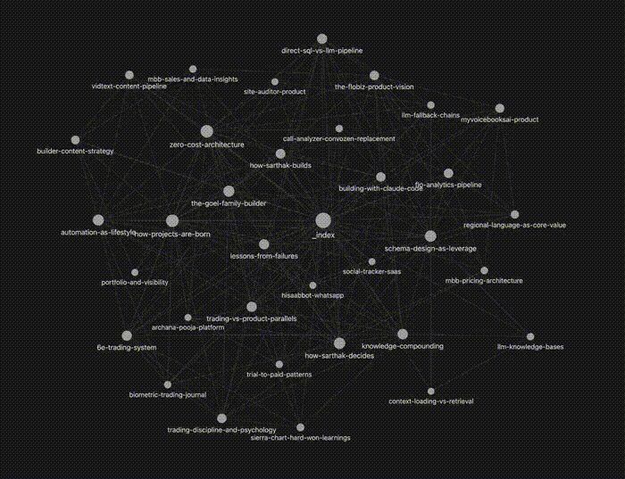

<p align="center">
  
</p>

# Second Brain

**Karpathy-style LLM knowledge base. Raw materials go in, interconnected wiki articles come out.**

<p align="center">
  
</p>

<p align="center">
  
</p>

## Why

You read articles, have conversations, take notes, learn from failures -- but none of it compounds. Six months later, you cannot find the insight that changed how you think about a problem. Second Brain is a personal knowledge base where an LLM reads everything you feed it, synthesizes structured wiki articles with cross-references, and surfaces non-obvious connections across domains. It is Obsidian meets a librarian who reads everything and never forgets.

## How

1. Drop raw materials into `raw/` -- articles, papers, tweets, conversation notes, brain dumps
2. Run `/brain ingest` -- the LLM reads every source fully, extracts key concepts, creates wiki articles with backlinks and source attribution
3. Run `/brain query "how does trading discipline apply to product?"` -- get answers grounded in your own knowledge
4. Run `/brain connect` -- discover cross-domain patterns: trading lessons that apply to product, engineering patterns that mirror business strategies
5. A daily cron (`scripts/daily-brain-feed.sh`) extracts insights from Claude Code sessions and saves them as raw notes

```
/brain ingest              # Process new raw materials into wiki
/brain compile             # Full recompilation from all sources
/brain query "topic"       # Ask questions across all knowledge
/brain connect             # Surface cross-domain patterns
/brain lint                # Health check: broken links, orphans
/brain add "insight"       # Quick-capture a note
/brain status              # Stats dashboard
```

## Features

| Command | What It Does | Detail |
|---------|-------------|--------|
| `/brain ingest` | Process new raw materials | Reads fully (never chunks), creates/updates wiki articles, adds backlinks |
| `/brain compile` | Full wiki recompilation | Scans all sources, finds gaps, rebuilds stale articles, runs lint |
| `/brain query` | Answer from knowledge base | Loads relevant articles, synthesizes grounded answer, saves to outputs |
| `/brain lint` | Wiki health check | Broken backlinks, orphan articles, missing attributions, stale content |
| `/brain connect` | Cross-domain pattern finder | Surfaces trading-to-product parallels, engineering-to-business mirrors |
| `/brain add` | Quick capture | Saves note to `raw/notes/` for later ingestion |
| `/brain status` | Stats dashboard | Article count, domain breakdown, word count, last ingest date |

## Tech

| Component | Technology |
|-----------|------------|
| Runtime | Claude Code slash command skill |
| Storage | Flat Markdown files (Obsidian-compatible) |
| Backlinks | `[[kebab-case]]` wiki-style cross-references |
| Frontmatter | YAML (title, domains, dates, source attribution) |
| Daily feed | Bash cron extracting Claude session insights |
| Domains | 7 tags: Trading, Product, Engineering, AI/LLM, Business, Content, Growth |
| Articles | 34 compiled articles across all domains |

## Architecture

```
second-brain/
├── CLAUDE.md                 # Schema: article format, rules, operations, domain tags
├── SKILL.md                  # Skill definition for /brain commands
├── raw/                      # Append-only source materials (human curates)
│   ├── articles/             # Web articles, blog posts
│   ├── papers/               # Research papers, PDFs
│   ├── tweets/               # Interesting tweets and threads
│   ├── conversations/        # Key insights from conversations
│   ├── notes/                # Brain dumps + daily session extracts
│   └── media/                # Images, screenshots, diagrams
├── wiki/                     # LLM-compiled articles (34 articles, 7 domains)
│   ├── _index.md             # Master index by domain
│   ├── _changelog.md         # What changed and when
│   ├── how-sarthak-builds.md
│   ├── zero-cost-architecture.md
│   ├── 6e-trading-system.md
│   ├── schema-design-as-leverage.md
│   └── ... (34 total)
├── outputs/                  # Query responses, lint reports, connection reports
├── scripts/
│   └── daily-brain-feed.sh   # Cron: extracts Claude session insights into raw/notes/
└── docs/
    └── logo.png
```

## Knowledge Domains

| Domain | Tag | Scope | Articles |
|--------|-----|-------|----------|
| Trading | `#trading` | 6E futures, price action, risk management, psychology | 5 |
| Product | `#product` | User research, prioritization, SMB insights, conversion | 11 |
| Engineering | `#engineering` | Architecture, system design, zero-cost infra, debugging | 8 |
| AI/LLM | `#ai` | Prompt engineering, RAG, agents, schema design | 4 |
| Business | `#business` | SaaS metrics, pricing, go-to-market | 2 |
| Content | `#content` | Audience building, storytelling, builder content | 2 |
| Growth | `#growth` | Learning frameworks, mental models, career | 2 |

## Rules the LLM Follows

| Rule | Why |
|------|-----|
| Never fabricate knowledge | Every insight must trace to a source in `raw/` |
| Prefer depth over breadth | One deep article over five shallow ones |
| Write for future-self | Include enough background for months-later reading |
| Cross-link aggressively | Every article links to at least 2 others -- connections are the value |
| Preserve dissent | When thinking evolves, keep old reasoning with dates |
| Kebab-case backlinks | `[[how-sarthak-decides]]` not `[[How Sarthak Decides]]` for Obsidian |
| Index under 200 entries | Archive or merge when the wiki grows |

## Status

| Item | State |
|------|-------|
| Ingest pipeline (raw to wiki) | Live |
| 34 wiki articles across 7 domains | Live |
| Cross-domain connection finder | Live |
| Lint (broken links, orphans, stale) | Live |
| Daily session insight extraction | Live |
| Obsidian-compatible markdown | Live |
| Query with grounded answers | Live |

## Fork This

Start your own Second Brain in 3 steps:

### Prerequisites

- [Claude Code](https://claude.ai/code) installed
- No MCP servers required -- runs entirely on local files

### Install

```bash
# 1. Clone the repo
git clone https://github.com/sarthakgoel31/second-brain.git
cd second-brain

# 2. Clean out my knowledge (start fresh)
rm -rf wiki/* raw/articles/* raw/papers/* raw/tweets/* raw/conversations/* raw/notes/*

# 3. Copy the skill definition into Claude Code
mkdir -p ~/.claude/skills/brain
cp SKILL.md ~/.claude/skills/brain/SKILL.md

# 4. Initialize your wiki
# In Claude Code, type: /brain status
```

### Start Building Your Brain

```bash
# Drop your first source material into raw/
cp ~/Downloads/interesting-article.md raw/articles/

# In Claude Code:
/brain ingest          # Process it into wiki articles
/brain status          # See your knowledge base stats
/brain query "what did I learn about X?"
```

### Customize

Open `CLAUDE.md` to adjust:
- **Domains** -- replace Trading/Product/Engineering with your own knowledge areas
- **Article format** -- tweak frontmatter fields for your use case
- **Daily feed** -- edit `scripts/daily-brain-feed.sh` to point to your Claude sessions directory
- **Backlink style** -- uses `[[kebab-case]]` for Obsidian compatibility by default

### Optional: Daily Auto-Feed

```bash
# Add to crontab to auto-extract insights from Claude sessions
crontab -e
# Add: 0 23 * * * /path/to/second-brain/scripts/daily-brain-feed.sh
```

The brain works with zero raw materials -- just start dropping files and running `/brain ingest`.

---

Built by [Sarthak Goel](https://github.com/sarthakgoel31)
